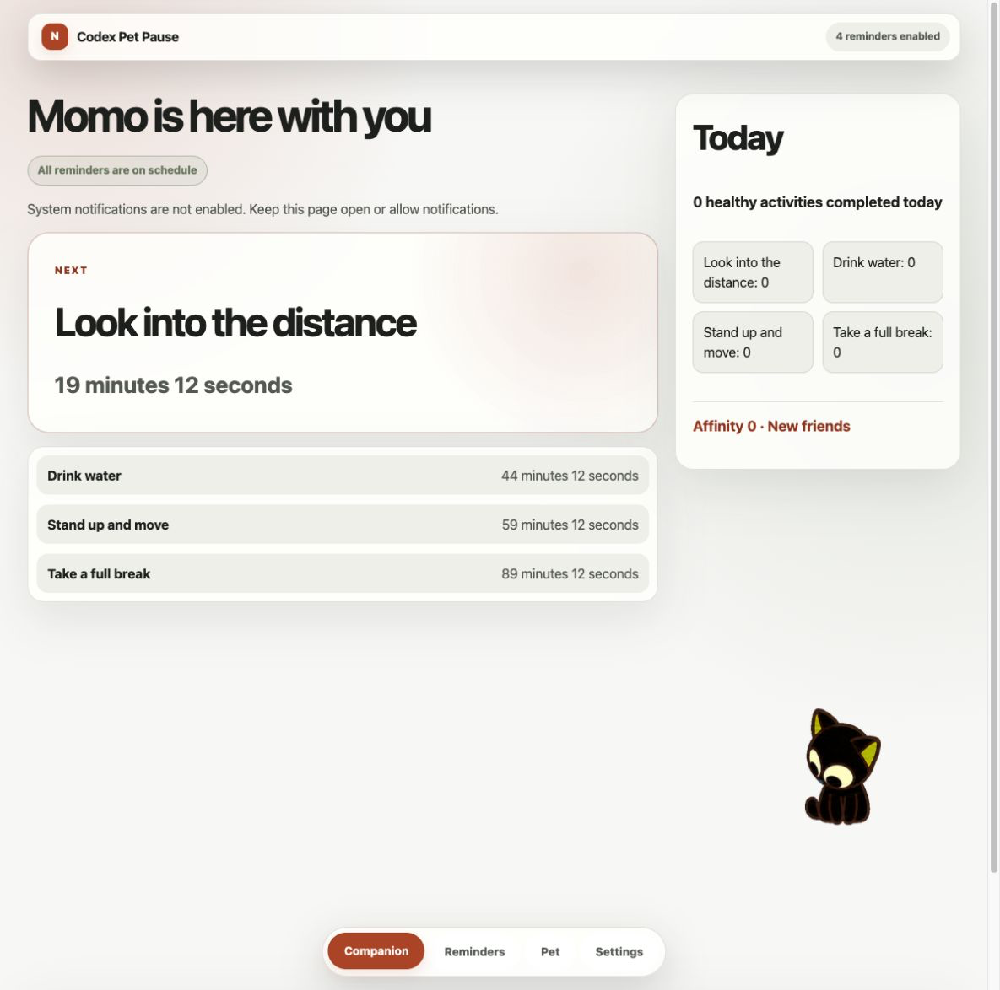

# Codex Pet Pause

[简体中文](README.zh-CN.md)

> A playful, local-first break reminder PWA hosted by a pet that lives in your computer.



## Why Codex Pet Pause?

Codex Pet Pause makes gentle breaks feel less mechanical. A companion on your desktop helps you schedule small moments to look away, drink water, stand up, or take a fuller break—without an account, server, or cloud sync.

## Features

- Four preset reminders (look away, drink water, stand up and move, and take a full break), plus configurable custom reminders.
- Reminder actions for doing an activity now, starting an optional action timer, completing it, postponing it, or skipping it.
- An interactive built-in cat, Momo, that can be petted and accompanies your reminders.
- Local Codex v1 and v2 pet import, alongside the built-in cat.
- Local-only persistence for settings, reminders, pet data, and activity history; no account, backend, or telemetry is required.
- Optional browser notifications and reminder sound, with useful in-page reminders when notifications are unavailable.
- Offline PWA behavior after the app shell has been cached.
- English and Simplified Chinese UI, plus light, dark, and system themes.
- Keyboard navigation and considered focus management for interactive controls and dialogs.
- Reduced-motion support and a setting to disable interface animations.

## Codex pet compatibility

Codex Pet Pause accepts compatible Codex pet v1 and v2 files. Import either one ZIP containing one Codex pet (one pet per ZIP), or the matching `pet.json` and WebP atlas as loose files. ZIPs may contain outer folders, are extracted only in this browser, and are never uploaded. A ZIP may contain at most one pet, must be no larger than 32 MiB compressed or expanded, and may contain at most 128 entries. The existing pet manifest and atlas limits are 64 KiB and 16 MiB.

## Quick start

Requirements: Node.js 22.12.0 or later and npm.

For contributor setup:

```bash
npm install
npm run dev
```

For a reproducible production build and local preview:

```bash
npm ci
npm run build
npm run preview
```

## Development

Run the available checks with:

```bash
npm run typecheck
npm run test:run
npm run test:e2e
npm run check
```

Before the first end-to-end run, install Chromium for Playwright:

```bash
npx playwright install chromium
```

## Deployment

The project is a static Vite PWA. The public GitHub Pages target is [ccofallen.github.io/codex-pet-pause](https://ccofallen.github.io/codex-pet-pause/); use the root-path build for most other static hosts. Production notifications and PWA installation require HTTPS.

See the [English deployment guide](docs/DEPLOYMENT.md) for GitHub Pages, Vercel, Netlify, and generic static-server instructions.

## Privacy and browser limitations

- Codex Pet Pause is frontend-only. It has no account system, backend, cloud sync, or telemetry.
- Settings, reminders, the built-in cat, locally imported pets, and activity history stay in this browser's local storage and IndexedDB. Activity history is retained for up to 90 days.
- Browser storage or notification support can be unavailable; in that case the app provides the supported in-page experience and may use a temporary session whose settings do not survive refresh.
- Background timing, system notifications, sound, and offline availability depend on browser capabilities, permissions, caching, and power-saving policies.
- **Reminders stop when the page or browser is fully closed.**

## Contributing

Issues and pull requests are welcome. Please keep changes focused, cover behavior with the appropriate checks, and avoid adding private pets, local data, credentials, build output, or generated browser artifacts to the repository.

## Acknowledgements

The built-in cat reminder sound, “Exploring curious kittens meowing,” is attributed to [ElevenLabs](https://elevenlabs.io/zh/sound-effects/kittens-meowing). See the [public asset provenance](docs/ASSET-PROVENANCE.md) for its source, checksum, and usage caveat.

## License

Codex Pet Pause is released under the [MIT License](LICENSE).
